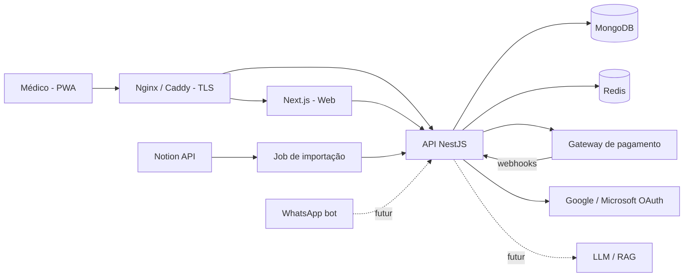

# 2. TRD — Technical Requirements Document

**Produto:** Infecto Consult — apoio à decisão clínica em infectologia à beira do leito
**Versão:** 0.4 (rascunho para aprovação)
**Data:** 04/10/2026
**Status:** 🟡 Aguardando aprovação

---

## 2.1 Linguagem para web (frontend)
| Item | Escolha | Motivo |
|---|---|---|
| Linguagem | TypeScript | Tipagem; contrato compartilhado com o backend |
| Framework | Next.js (React), build `standalone` | PWA, SSR para páginas públicas, roteamento; roda em Node no servidor próprio |
| Estado/dados | TanStack Query + Zustand | Cache de consultas; estado do passo a passo |
| UI | Tailwind CSS + componentes próprios (Radix UI) | Mobile-first, acessível |
| Editor de blocos | TipTap (ProseMirror) com extensões customizadas | Blocos de pergunta, condição e conduta |
| Fluxograma | React Flow | Visualização do algoritmo na autoria |
| Autenticação | Auth.js (provedores Google e Microsoft Entra ID) | OAuth padrão |
| Busca | Chamada à API (índice de texto do MongoDB) | Ver 2.4 |
| Testes | Vitest, Testing Library, Playwright (E2E) | |

## 2.2 Linguagem para mobile
| Fase | Escolha | Motivo |
|---|---|---|
| Versão 1 | **PWA** (service worker, manifest, instalável) | Um só código, sem lojas, atualização imediata |
| Versão 2 (opcional) | Empacotamento (Capacitor) ou React Native | Só se houver necessidade de lojas/notificações nativas |

## 2.3 Linguagem para o backend
| Item | Escolha |
|---|---|
| Linguagem | TypeScript (Node.js LTS) |
| API | NestJS (REST/JSON), documentação OpenAPI |
| ODM | Mongoose (schemas) + validação com Zod/class-validator |
| Autenticação | Verificação de sessão/JWT emitido após OAuth; guards por perfil (RBAC) |
| Pagamentos | Gateway com webhooks (proposta: Stripe Billing; ver ponto em aberto) |
| Tarefas | BullMQ + Redis (webhooks, importação do Notion, e-mails) |
| Testes | Jest + Supertest |
| Qualidade | ESLint, Prettier, TypeScript estrito, Husky |

### Integrações
| Integração | Uso | Observação |
|---|---|---|
| Google / Microsoft OAuth | Login | Escopos mínimos: `openid email profile` |
| Gateway de pagamento | Assinatura recorrente por cartão | **Recomendado: Asaas** (assinaturas, cartão tokenizado, webhooks, taxa baixa para ticket de R$ 15). Alternativa: Stripe (trial nativo, melhor documentação, taxa fixa maior). Trial de 5 dias: cartão tokenizado + 1ª cobrança agendada para D+5. Webhooks assinados e idempotentes; sem dados de cartão no servidor |
| Importação de conteúdo | Migrar os 17 protocolos do Notion/HTML | Os decisores em HTML têm lógica em JavaScript própria: **migração assistida** (conversão para blocos + grafo, com revisão humana), não automática. Notion API opcional depois (token em `.env`) |
| E-mail transacional (SMTP/SES) | Confirmação, recibo, avisos | A definir |
| *(Futuro)* LLM / RAG | Chat com IA treinado nos protocolos | Fora da v1 |
| *(Futuro)* WhatsApp Cloud API | Bot de consulta | Reaproveita o mesmo motor de protocolo da API |

**Estratégia de importação do Notion:** leitura paginada → conversão de blocos Notion para o modelo de blocos do app → rascunho para revisão humana (nunca publica automaticamente) → idempotência por `notion_page_id`.

## 2.4 Banco de dados
| Item | Escolha |
|---|---|
| SGBD | **MongoDB** (replica set, mínimo 1 nó com oplog para transações e change streams) |
| Motivo | Protocolos têm estrutura variável; documentos aninhados (blocos e grafo) se encaixam bem |
| Migrações | `migrate-mongo` (índices e ajustes de schema) |
| Busca | Índice de texto (`$text`) com pesos e sinônimos tratados na API. *Atlas Search não existe em MongoDB self-hosted; alternativa futura: Meilisearch/OpenSearch* |
| Cache/fila | Redis |
| Versões | Coleção separada `protocol_versions`, imutável (append-only) |
| Backup | `mongodump` diário + cópia fora do servidor; retenção 30 dias; teste de restauração mensal |
| Volume estimado | Baixo (centenas de protocolos, milhares de usuários); a validar |
| Isolamento multi-empresa | Não aplicável na v1 (assinatura individual) |

## 2.5 Arquitetura

**Camadas do backend**
| Pasta | Responsabilidade |
|---|---|
| `modules/auth` | Login OAuth, sessão, guards RBAC |
| `modules/users` | Perfil do médico, CRM |
| `modules/billing` | Planos, assinaturas, webhooks |
| `modules/protocols` | CRUD, publicação, versões, referências |
| `modules/engine` | Motor que avalia o algoritmo (respostas → próxima etapa → conduta) |
| `modules/search` | Busca e catálogo |
| `modules/import` | Importador Notion |
| `modules/admin` | Usuários, métricas, auditoria |

**Motor do protocolo:** o protocolo é um **grafo de nós** (informação, pergunta, condição, conduta) com arestas condicionais. O mesmo motor atende web, e no futuro IA e WhatsApp.

**Servidor e domínio:** produção em `129.121.37.33`, domínio `https://infectoconsult.com.br/` (configuração de servidor, DNS e TLS fica para a Sprint 1; nada será configurado antes da aprovação). O site/landing será parte do Next.js (rotas públicas) e envia os formulários à API, que grava em `leads` no MongoDB.
**Notificações:** e-mail transacional + Web Push (PWA, VAPID) + central no app; disparadas pela fila (BullMQ) quando um protocolo é enviado para revisão.
**Trial/cobrança:** teste de 5 dias com cartão cadastrado e cobrança automática de R$ 15,00/mês ao final (a confirmar com o gateway).
**Hospedagem:** servidor próprio, com Docker Compose (`web`, `api`, `mongo`, `redis`, `proxy`), TLS via Let's Encrypt, firewall expondo apenas 80/443, MongoDB e Redis somente em rede interna.
**Ambientes:** dev (local) → hml (mesmo servidor, stack separada) → prd · **CI/CD:** GitHub Actions: lint, testes, build de imagens; deploy via SSH/registry privado.

### Segurança
- Login só por OAuth; sessão em cookie `HttpOnly`, `Secure`, `SameSite=Lax`.
- RBAC no backend: Leitor (consulta, com assinatura ativa), Contribuidor (cria/edita rascunhos), Revisor (publica), Admin (tudo).
- Segredos em `.env` fora do repositório ou cofre; nunca em documentos.
- Cabeçalhos de segurança (CSP, HSTS), CORS restrito ao domínio, rate limiting.
- Webhook do gateway com verificação de assinatura.
- Auditoria de alterações em protocolos e permissões.
- Nenhum dado de paciente armazenado.

### Segurança de endpoints e superfície de ataque (v0.4)
**Princípio:** negar por padrão. Toda rota exige autenticação, perfil e (quando aplicável) assinatura, salvo uma lista curta e explícita de rotas públicas.

| Controle | Regra |
|---|---|
| Rotas públicas (allowlist) | Apenas `GET /health` (sem detalhes), `POST /public/leads`, páginas do site, callbacks OAuth e `POST /billing/webhook` (assinatura verificada). Qualquer outra rota sem guard falha no CI (teste que lista as rotas e confere os guards) |
| Autorização | Guards globais: `AuthGuard` → `RolesGuard` → `SubscriptionGuard`. Verificação **no backend**, nunca só no front. Checagem de propriedade do recurso (ex.: autor só edita o próprio rascunho; revisor ≠ autor) para evitar IDOR/BOLA |
| Conteúdo premium | Protocolos só saem da API para assinantes ativos/em trial; rotas de autoria nunca expostas a leitores; rascunhos e "em teste" nunca retornam em rotas de leitura |
| Rotas administrativas | `/admin/*` só para Admin, acesso preferencialmente restrito por rede/VPN ou lista de IPs; MFA exigido para Admin via provedor OAuth |
| Rate limiting | Global por IP e por usuário; limites rígidos em `/public/leads`, login e `/protocols/:slug/evaluate`; proteção contra scraping do catálogo (limites por assinatura, detecção de volume anormal) |
| Formulário do site | Captcha (Turnstile/hCaptcha), honeypot, validação de tamanho e formato, sanitização; sem eco de dados na resposta |
| Validação de entrada | Schemas Zod/DTO com `whitelist` e `forbidNonWhitelisted`; limite de tamanho de corpo; sanitização do HTML dos blocos (allowlist, sem scripts) para evitar XSS armazenado; consultas MongoDB com operadores filtrados (anti NoSQL injection, `$where`/`$ne` bloqueados nos inputs) |
| Documentação da API | Swagger/OpenAPI **desligado em produção** (ou protegido); sem rotas de debug; respostas de erro genéricas, sem stack trace |
| Sessão/CSRF | Cookie `HttpOnly`/`Secure`/`SameSite`, token CSRF em operações de escrita, expiração e revogação de sessão; tokens JWT curtos com refresh rotativo |
| CORS e cabeçalhos | CORS restrito a `infectoconsult.com.br`; CSP, HSTS, `X-Content-Type-Options`, `Referrer-Policy`, `frame-ancestors 'none'` |
| Webhook de pagamento | Verificar assinatura/segredo, idempotência por `eventId`, aceitar só do gateway, ignorar eventos antigos |
| Rede do servidor | Só 80/443 expostas; MongoDB e Redis em rede interna **sem porta pública**, autenticação ligada, TLS interno; SSH por chave, sem senha, porta restrita/fail2ban; firewall (ufw); containers sem root e imagens atualizadas |
| Segredos | `.env` fora do repositório/cofre, rotação periódica, scanner de segredos no CI; chaves de gateway e OAuth separadas por ambiente |
| Dados | Nenhum dado de paciente; dados pessoais do médico mínimos e criptografados em repouso quando possível; backups criptografados |
| Auditoria e monitoramento | Log de acessos negados, mudanças de perfil, publicações e falhas de webhook; alertas para picos de 401/403/429; logs sem dados sensíveis |
| Testes de segurança | Testes automatizados de autorização por rota e perfil; OWASP ZAP/Nuclei contra hml; revisão de dependências (`npm audit`, Dependabot); pentest básico antes do go-live |
| Resposta a incidentes | Procedimento para revogar sessões, rotacionar segredos e comunicar (LGPD) |

## Decisões
| # | Tema | Decisão |
|---|---|---|
| T8 | Segurança | Negar por padrão, allowlist de rotas públicas, checagem no backend, MongoDB/Redis sem porta pública (v0.4) |
| T1 | Frontend | Next.js + TypeScript, PWA |
| T2 | Backend | NestJS (TypeScript) — *proposta* |
| T3 | Banco | MongoDB (decisão do usuário) |
| T4 | Hospedagem | Servidor próprio com Docker Compose (decisão do usuário) |
| T5 | Modelo do protocolo | Grafo de nós + blocos de conteúdo |

| T6 | Servidor/domínio | 129.121.37.33 e infectoconsult.com.br; configurar depois (v0.2) |
| T7 | Notificação de revisão | E-mail + Web Push + central no app (v0.2) |

## Pendente
1. Especificações do servidor (SO, CPU, RAM, disco, quem administra, acesso SSH)? O IP é só referência por enquanto.
2. Já existe MongoDB instalado ou será containerizado?
3. Gateway de pagamento definitivo.
4. Provedor de e-mail transacional.
5. Repositório de código (GitHub/GitLab) e registry de imagens.
