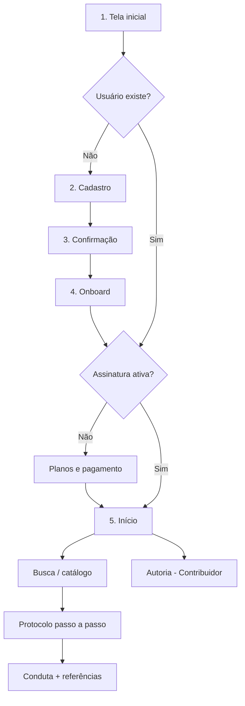
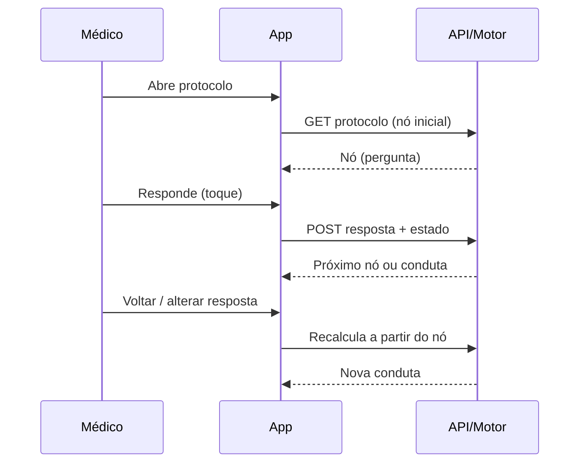
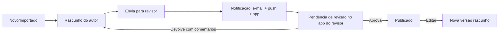

# 3. Fluxo do APP

**Produto:** Infecto Consult — apoio à decisão clínica em infectologia à beira do leito
**Versão:** 0.2 (rascunho para aprovação)
**Data:** 04/10/2026
**Status:** 🟡 Aguardando aprovação

---

## Fluxo da informação no APP

### Visão macro

### Fluxo dos dados (fonte → processamento → tela)
| Fonte | Processamento | Tela |
|---|---|---|
| Google/Microsoft | OAuth → cria/atualiza usuário | Cadastro / Confirmação |
| Gateway | Webhook → status da assinatura | Planos / Início |
| `protocols` publicado | Busca e catálogo | Início, Resultados |
| `protocols` + respostas | Motor avalia o grafo | Execução do protocolo |
| `protocol_versions` | Histórico e diff | Autoria |
| Notion | Importação → rascunhos | Autoria |

## 1. Tela inicial
Logo, frase de valor, botões **Entrar com Google** e **Entrar com Microsoft**, links de termos e privacidade.
**Regras:** sem senha; usuário autenticado e assinante vai direto ao Início.

## 2. Cadastro
Automático no primeiro login (nome, e-mail, foto vêm do provedor); solicita CRM, UF e especialidade.
**Regras:** perfil inicial = Leitor; e-mail único; contribuidores são promovidos pelo Admin.

## 3. Confirmação
Revisão dos dados, aceite de termos/disclaimer clínico e política de privacidade (LGPD).
**Regras:** sem aceite, sem acesso; registro de data/versão do aceite.

## 4. Onboard
Tour curto de 3 telas (buscar → responder perguntas → ver conduta) e escolha de áreas de interesse (opcional).
**Regras:** pode ser pulado; exibido uma vez.

## 5. Início

### Estrutura de navegação (barra inferior, padrão Instagram/Spotify)
| Menu | Conteúdo |
|---|---|
| **Início** | Busca em destaque, recentes, favoritos, protocolos em alta |
| **Catálogo** | Categorias (respiratório, urinário, SNC, pele, abdominal, etc.) |
| **Favoritos** | Protocolos salvos |
| **Escrever** *(só Contribuidor/Revisor)* | Meus rascunhos, em revisão, publicados, **Pendências de revisão** (com contador) |
| **Perfil** | Dados, assinatura, preferências, termos, sair |

### Execução do protocolo

**Regras:** uma pergunta por tela; barra de progresso; botão Voltar; menu lateral/aba para saltar entre seções; resumo final com esquema terapêutico, versão, data e referências; estado do passo a passo guardado no cliente (nada sobre paciente vai ao servidor).

### Fluxo de autoria e revisão

**Regras:** só publicado vai aos leitores; autor e revisor são pessoas diferentes; o revisor deve ter a área de competência do tema; ao entrar no app, o revisor vê o aviso/aba **Pendências** com o contador; cada publicação gera versão imutável com resumo da alteração; referências vinculadas por bloco.

### Site → banco de dados
O site `infectoconsult.com.br` apresenta o produto e coleta cadastros/interesse (formulário com consentimento LGPD); os dados são enviados à API e gravados em `leads`. O botão "Entrar" leva ao app.

### Teste e assinatura
Após a confirmação, o médico inicia o **teste de 5 dias** (cartão cadastrado); ao fim, cobrança de R$ 15,00/mês. A tela Perfil mostra dias restantes e permite cancelar.

### Estados de tela
| Estado | Comportamento |
|---|---|
| Carregando | Esqueleto (skeleton) |
| Vazio | Mensagem + ação (ex.: "Nenhum favorito ainda") |
| Erro | Mensagem clara + tentar novamente |
| Sem assinatura | Redireciona para Planos |
| Sem permissão | Mensagem; ação bloqueada também no backend |
| Offline | Aviso; favoritos em cache (se habilitado) |

## Decisões
| # | Tema | Decisão |
|---|---|---|
| F1 | Navegação | Barra inferior de 4–5 abas |
| F2 | Interação | Uma pergunta por tela |
| F3 | Dados do paciente | Nunca enviados ao servidor |

## Pontos em aberto
1. O paywall bloqueia a busca inteira ou há prévia gratuita?
2. Contribuidores precisam de assinatura de leitor?
3. Onboard coleta áreas de interesse?
