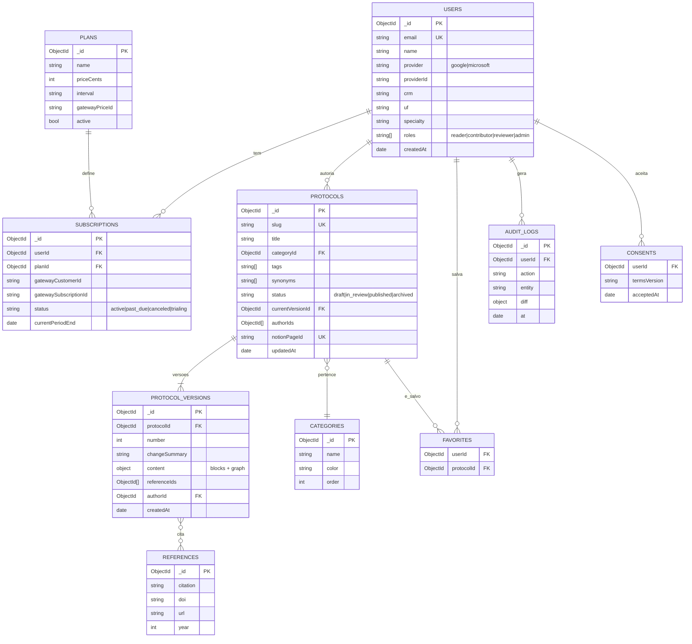
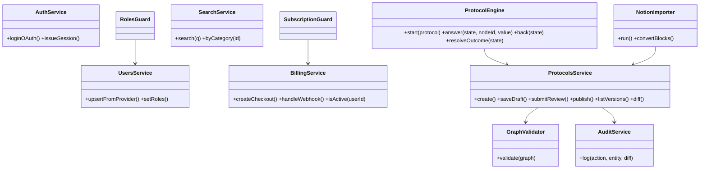

# 5. Esquema do Backend

**Produto:** Infecto Consult — apoio à decisão clínica em infectologia à beira do leito
**Versão:** 0.3 (rascunho para aprovação)
**Data:** 04/10/2026
**Status:** 🟡 Aguardando aprovação

---

## 5.1 Modelo de dados (MongoDB)

Coleções: `users`, `subscriptions`, `plans`, `protocols`, `protocol_versions`, `reviews`, `notifications`, `leads`, `references`, `categories`, `favorites`, `audit_logs`, `consents`, `import_jobs`.

**Novas na v0.2**
| Coleção | Campos principais |
|---|---|
| `reviews` | `protocolId`, `versionId`, `authorId`, `reviewerId` (≠ author), `assignedBy` (system \| adminId), `dueAt` (prazo), `reminderSentAt`, `status` (pending, approved, returned, overdue), `comments[]`, `requestedAt`, `decidedAt` |
| `notifications` | `userId`, `type` (review_requested, review_returned, published), `refId`, `channels` (email, push, app), `readAt`, `createdAt` |
| `leads` | `name`, `email`, `crm`, `uf`, `source` (site), `consent`, `createdAt` (coletados pelo site infectoconsult.com.br) |
| `users.competencies` | `string[]` de áreas (ex.: pneumologia, SNC) para direcionar revisões; `users.crmVerified` (bool), `users.pushSubscriptions[]` |
| `plans` / `subscriptions` | plano inicial: `priceCents=1500`, `interval=month`, `trialDays=5`; status `trialing` até o fim do teste |



### Metadados do protocolo (v0.3, a partir da base do Notion)
Em `protocols`: `type` (syndrome | reasoning | pathogen | drug), `shortDescription`, `imageUrl`, `imageSource`, `environments[]` (ps, ward, icu, outpatient), `populations[]` (adult, pregnant, immunosuppressed, hiv, elderly), `system`, `drugClass`, `syndromeType`, `tags[]`, `priority`, `nextReviewAt`, `publishOnSite` (bool), `premium` (bool), `pageLevel`, `legacyStatus` (draft | testing | published), `reviewDueAlert`.

### Conteúdo da versão (`content`)
`content.tabs[]`: cada aba tem `title`, `icon` e seus próprios `blocks` e, opcionalmente, `graph` (ex.: aba "Decisor" com grafo; abas "Líquor/Tratamento" com tabelas). O exemplo abaixo mostra o conteúdo de uma aba.
```jsonc
{
  "blocks": [ { "id": "b1", "type": "heading|text|list|table|alert|image|reference", "data": {} } ],
  "graph": {
    "start": "n1",
    "nodes": [
      { "id": "n1", "type": "question", "text": "Idade ≥ 65 anos?", "answer": "boolean|single|multi|number",
        "options": [ { "id": "o1", "label": "Sim" } ] },
      { "id": "n2", "type": "condition", "expr": "n1 == 'o1' && comorb >= 2" },
      { "id": "n3", "type": "outcome", "title": "Internação", "therapy": [
        { "drug": "Ceftriaxona", "dose": "1 g", "route": "IV", "freq": "12/12h", "duration": "7 dias", "notes": "" } ],
        "blockRefs": ["b4"] }
    ],
    "edges": [ { "from": "n1", "to": "n2", "when": "o1" } ]
  }
}
```
Protocolo só descritivo = `blocks` sem `graph`. Estrutura livre: nenhum campo de seção é obrigatório.

### Índices principais
| Coleção | Índice |
|---|---|
| `users` | `email` único; `providerId` |
| `protocols` | `slug` único; texto em `title`, `tags`, `synonyms`; `status` + `categoryId` |
| `protocol_versions` | `(protocolId, number)` único |
| `subscriptions` | `userId`; `gatewaySubscriptionId` único |
| `favorites` | `(userId, protocolId)` único |
| `audit_logs` | `(entity, at)` |

### Regras
- `protocol_versions` é append-only; publicar cria nova versão e move `currentVersionId`.
- Leitor só acessa `protocols` com `status=published` e assinatura `active|trialing`.
- Validação do grafo na publicação: nó inicial existe, sem nós órfãos, todo caminho termina em `outcome`.

## 5.2 Modelo de classes

`ProtocolEngine` é **stateless**: o estado (respostas) vem do cliente a cada chamada, sem armazenar dados do caso clínico.

## 5.3 API (contrato resumido)
| Método | Rota | Descrição | Perfil |
|---|---|---|---|
| GET | `/auth/me` | Usuário e assinatura | Autenticado |
| POST | `/consents` | Aceite de termos | Autenticado |
| GET | `/categories` | Categorias | Assinante |
| GET | `/protocols?q=&category=` | Busca/lista publicados | Assinante |
| GET | `/protocols/:slug` | Protocolo publicado | Assinante |
| POST | `/protocols/:slug/evaluate` | Motor: `{state, nodeId, answer}` → próximo nó/conduta | Assinante |
| GET/POST/DELETE | `/favorites` | Favoritos | Assinante |
| POST | `/billing/checkout` | Inicia assinatura | Autenticado |
| POST | `/billing/webhook` | Webhook do gateway | Gateway (assinado) |
| GET | `/billing/portal` | Gestão do cartão/assinatura | Autenticado |
| POST | `/authoring/protocols` | Cria protocolo (rascunho) | Contribuidor |
| PUT | `/authoring/protocols/:id` | Salva rascunho | Contribuidor |
| POST | `/authoring/protocols/:id/submit` | Envia para revisão `{reviewerId}`; gera notificação | Contribuidor |
| GET | `/reviews/pending` | Pendências de revisão do usuário | Revisor |
| POST | `/reviews/:id/approve` | Aprova e publica | Revisor (≠ autor) |
| POST | `/reviews/:id/return` | Devolve com comentários | Revisor |
| GET | `/reviewers?topic=` | Sugere revisores por competência (o sistema já atribui automaticamente) | Contribuidor |
| PATCH | `/admin/reviews/:id` | Admin atribui/troca revisor e prazo | Admin |
| GET | `/notifications` · PATCH `/notifications/:id/read` | Central de notificações | Autenticado |
| POST | `/push/subscribe` | Registra Web Push | Autenticado |
| POST | `/public/leads` | Site grava interessado/cadastro | Público (rate limit + captcha) |
| GET | `/authoring/protocols/:id/versions` | Histórico | Contribuidor |
| GET | `/authoring/protocols/:id/diff?from=&to=` | Comparar versões | Contribuidor |
| CRUD | `/references` | Referências | Contribuidor |
| POST | `/admin/import/notion` | Dispara importação | Admin |
| GET/PATCH | `/admin/users` | Usuários e perfis | Admin |
| GET | `/admin/metrics` | Métricas | Admin |

## 5.4 Estrutura do repositório
```
infecto-consult/
├─ apps/
│  ├─ web/            # Next.js (PWA)
│  └─ api/            # NestJS
│     └─ src/modules/{auth,users,billing,protocols,engine,search,import,admin}
├─ packages/
│  └─ shared/         # tipos e schemas Zod
├─ infra/
│  ├─ docker-compose.yml
│  ├─ proxy/          # Nginx/Caddy
│  └─ scripts/        # backup, restore
├─ docs/              # os 6 documentos
└─ .github/workflows/
```

## Decisões
| # | Tema | Decisão |
|---|---|---|
| B1 | Versões | Coleção imutável separada |
| B2 | Conteúdo | Blocos + grafo opcional em JSON |
| B3 | Estado do caso clínico | No cliente; motor stateless |
| B4 | Revisão | Coleção `reviews`, revisor ≠ autor, com notificação (v0.2) |
| B5 | Site | `leads` alimentada por endpoint público (v0.2) |

## Pontos em aberto
1. Estrutura real dos protocolos no Notion (para ajustar o conversor).
2. O diff entre versões é textual, por bloco ou ambos?
3. Retenção de `audit_logs`.
