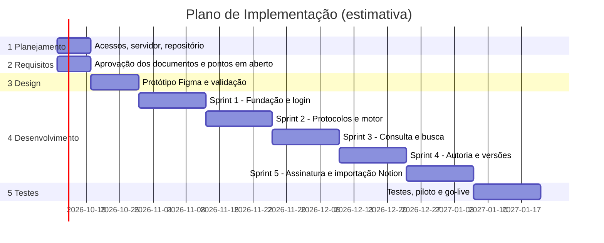

# 6. Plano de Implementação

**Produto:** Infecto Consult — apoio à decisão clínica em infectologia à beira do leito
**Versão:** 0.3 (rascunho para aprovação)
**Data:** 04/10/2026
**Status:** 🟡 Aguardando aprovação

---

> ⛔ A implementação só começa depois da aprovação dos documentos 01 a 06.

## Sequência de construção

*Datas são estimativas e dependem da aprovação.*

## 1. Planejamento
- [ ] Servidor de produção `129.121.37.33` e domínio `infectoconsult.com.br`: SO, recursos, acesso SSH, DNS e TLS (**configurar depois**, na Sprint 1)
- [ ] Repositório e CI/CD
- [ ] Credenciais OAuth (Google Cloud, Microsoft Entra), conta no gateway, token do Notion (em cofre/`.env`, nunca no repositório)
- [ ] Ambientes dev/hml/prd

## 2. Requisitos
- [ ] Aprovação explícita dos 6 documentos
- [ ] Resolver os pontos em aberto (PRD, TRD, Fluxo, UI, Esquema)
- [ ] Analisar a base do Notion (volume, propriedades, blocos): depende de exportação ou token de integração
- [ ] Definir como o CRM é validado e como o revisor é escolhido
- [ ] Validar com 2–3 médicos o formato dos algoritmos

## 3. Design
- [ ] Protótipo no Figma (mobile-first + editor)
- [ ] Validação visual e teste de usabilidade com médicos plantonistas
- [ ] Definição final da identidade visual

## 4. Desenvolvimento
| Sprint | Itens | **Entrega** |
|---|---|---|
| 1 | Monorepo, Docker Compose, MongoDB, Next.js PWA base, NestJS, login Google/Microsoft, perfis, consentimento | Login funcionando no servidor próprio, com perfis |
| 2 | Modelo de protocolos, versões, referências, motor do grafo, validador | Protocolo de exemplo executado via API |
| 3 | Busca, catálogo, telas de consulta e conduta, favoritos | Médico consulta um protocolo completo no celular |
| 4 | Editor de blocos, blocos interativos, fluxo rascunho→revisão→publicado, histórico e diff, **escolha de revisor por competência, notificações (e-mail, push, app) e aba Pendências** | Autor envia; o 2º médico é notificado, vê a pendência e aprova; protocolo publicado com versão e referências |
| 5 | Gateway, **teste de 5 dias + R$ 15/mês**, webhooks, paywall, migração assistida dos 17 protocolos (HTML/Notion), painel admin, atribuição de revisor por competência com prazo e lembretes, **site/landing com captura de leads** | Assinatura por cartão, site gravando no banco e protocolos do Notion importados como rascunho |

**Pós-v1 (roadmap):** chat com IA treinado nos protocolos (RAG); bot de WhatsApp; novos planos; modo offline.

## 5. Testes
| Tipo | Ferramenta | Quando |
|---|---|---|
| Unitários | Vitest / Jest | Contínuo |
| Motor do protocolo | Jest com casos clínicos validados | Sprint 2 em diante |
| Integração API | Supertest | Cada sprint |
| E2E | Playwright | Sprints 3–5 |
| Pagamento | Modo teste do gateway + webhooks | Sprint 5 |
| Segurança | Teste automatizado de guards por rota/perfil (cada sprint), ZAP/Nuclei em hml, `npm audit`, varredura de portas do servidor, revisão de RBAC/IDOR, pentest básico | Cada sprint + antes do go-live |
| Usabilidade | Teste com médicos | Design e pré-go-live |
| Restauração de backup | Manual | Antes do go-live |

**Critérios de aceite do go-live**
- Login, assinatura e consulta funcionando de ponta a ponta
- Todo protocolo publicado revisado por clínico, com versão e referências
- Backup restaurado com sucesso
- Nenhum dado de paciente armazenado
- Checklist de segurança do TRD cumprido: nenhuma rota fora da allowlist sem autenticação, MongoDB/Redis inacessíveis pela internet, Swagger desligado, rate limit ativo
- Termos, privacidade e disclaimer publicados

## Riscos e mitigação
| Risco | Impacto | Mitigação |
|---|---|---|
| Erro clínico em protocolo | Crítico | Fluxo de revisão, versões, referências, disclaimer |
| Estrutura do Notion muito heterogênea | Atraso | Importar como rascunho, revisão humana |
| Servidor único | Indisponibilidade | Backups externos, monitoramento, plano de restauração |
| MongoDB self-hosted sem Atlas Search | Busca limitada | Índice de texto agora; Meilisearch depois |
| Falha de pagamento/webhook | Acesso indevido ou bloqueio | Idempotência, reconciliação periódica |
| Credenciais vazadas | Segurança | `.env` fora do repositório, rotação |
| Escopo de IA/WhatsApp crescer | Atraso | Fora da v1; motor stateless já preparado |
| Conformidade LGPD/regulatória (software de apoio clínico) | Jurídico | Sem dados de paciente; revisão jurídica |

## Decisões
| # | Tema | Decisão |
|---|---|---|
| P1 | Entrega | 5 sprints de 2 semanas após aprovação |

## Pontos em aberto
1. Data desejada de lançamento e equipe disponível.
2. Existência de piloto com médicos antes do go-live.
